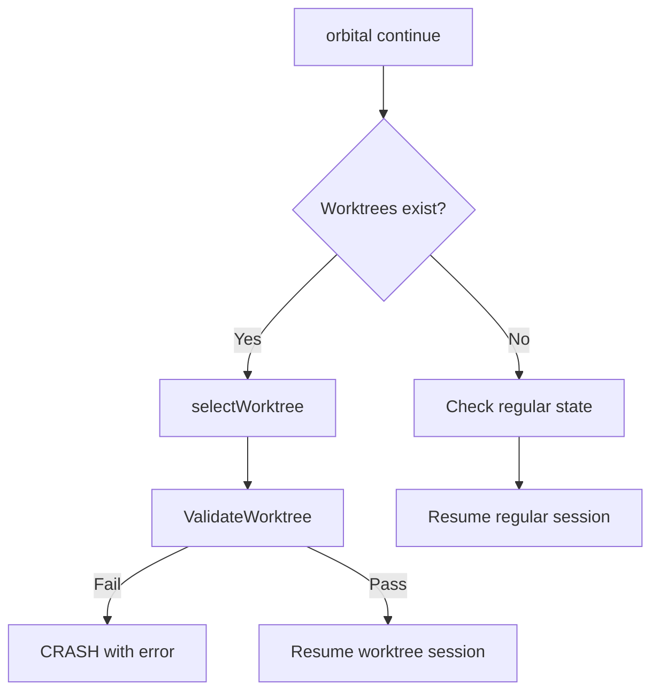
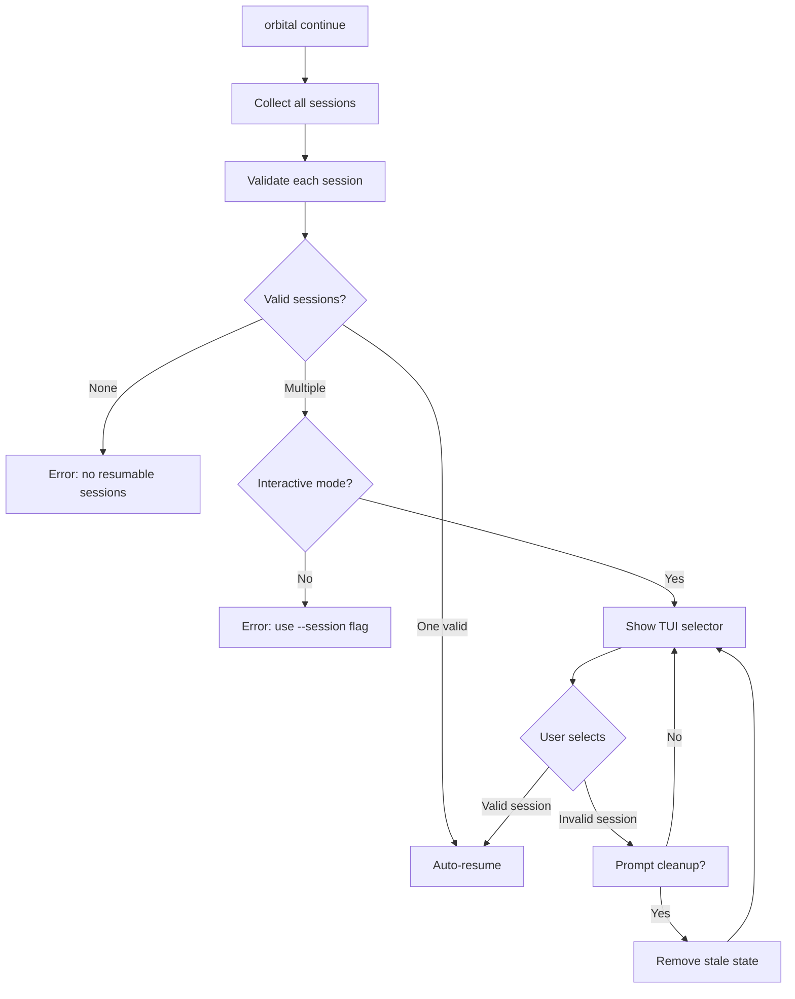

# Tech Proposal: Unified Session Selector for `orbital continue`

**Date**: 2026-01-25
**Status**: Draft
**Author**: Claude

## Problem Statement

When running `orbital continue` with multiple sessions (normal and worktree), if a worktree was manually deleted, the command crashes instead of gracefully presenting available sessions:

```
Error: worktree validation failed: worktree directory not found: /path/to/worktree
```

The expected behaviour is a TUI-based session chooser that:
- Shows all available sessions (worktree and non-worktree) in a unified list
- Displays invalid/stale sessions greyed out with a warning indicator
- Prompts for cleanup when selecting an invalid session
- Auto-resumes when only one valid session exists

## Current Architecture



The flow in `cmd/orbital/continue.go` is:

1. Load worktrees from `worktree-state.json` (line 68-69)
2. If worktrees exist, select one via `selectWorktree` (line 71)
3. **Immediately validate** the selected worktree (line 77)
4. If validation fails, crash with error (line 78)
5. Only then check for regular state (line 97-111)

**Root cause**: Validation happens before considering alternative sessions. The worktree path takes priority and fails hard.

### Relevant Files

| File | Purpose |
|------|---------|
| `cmd/orbital/continue.go` | Entry point, session selection logic |
| `internal/worktree/state.go` | Worktree state management, `ValidateWorktree()` |
| `internal/state/state.go` | Regular session state management |
| `internal/tui/model.go` | Existing TUI framework (bubbletea) |

### Current Data Structures

**Worktree State** (`internal/worktree/state.go:16-26`):
```go
type WorktreeState struct {
    Name           string    `json:"name,omitempty"`
    Path           string    `json:"path"`
    Branch         string    `json:"branch"`
    OriginalBranch string    `json:"originalBranch"`
    SpecFiles      []string  `json:"specFiles"`
    SessionID      string    `json:"sessionId,omitempty"`
    CreatedAt      time.Time `json:"createdAt"`
}
```

**Regular State** (`internal/state/state.go:31-44`):
```go
type State struct {
    SessionID    string    `json:"session_id"`
    PID          int       `json:"pid"`
    WorkingDir   string    `json:"working_dir"`
    ActiveFiles  []string  `json:"active_files"`
    StartedAt    time.Time `json:"started_at"`
    // ...
}
```

## Proposed Architecture



### New Abstractions

#### Unified Session Type

```go
// internal/session/session.go

package session

import (
    "time"
    "github.com/flashingpumpkin/orbital/internal/state"
    "github.com/flashingpumpkin/orbital/internal/worktree"
)

// SessionType distinguishes between session sources.
type SessionType int

const (
    SessionTypeRegular SessionType = iota
    SessionTypeWorktree
)

// Session represents a resumable orbital session (worktree or regular).
type Session struct {
    ID           string
    Type         SessionType
    Name         string      // Display name (worktree name or "main session")
    SpecFiles    []string
    CreatedAt    time.Time

    // Validation state
    Valid        bool
    InvalidReason string

    // Source data (one will be set based on Type)
    WorktreeState *worktree.WorktreeState
    RegularState  *state.State
}

// Collector gathers all available sessions.
type Collector struct {
    workingDir string
}

// Collect returns all sessions (valid and invalid) from the working directory.
func (c *Collector) Collect() ([]Session, error)

// ValidSessions returns only valid, resumable sessions.
func (c *Collector) ValidSessions(sessions []Session) []Session
```

#### TUI Session Selector

```go
// internal/tui/selector/model.go

package selector

import (
    tea "github.com/charmbracelet/bubbletea"
    "github.com/flashingpumpkin/orbital/internal/session"
)

// Model is the bubbletea model for session selection.
type Model struct {
    sessions    []session.Session
    cursor      int
    selected    *session.Session
    showCleanup bool
    cleanupIdx  int
    quitting    bool
    styles      Styles
}

// Result contains the selection outcome.
type Result struct {
    Session       *session.Session  // Selected session (nil if cancelled)
    CleanupPaths  []string          // Paths to clean up (confirmed by user)
    Cancelled     bool
}

func New(sessions []session.Session) Model
func (m Model) Init() tea.Cmd
func (m Model) Update(msg tea.Msg) (tea.Model, tea.Cmd)
func (m Model) View() string

// Run executes the selector and returns the result.
func Run(sessions []session.Session) (*Result, error)
```

### Session Display Format

```
 Orbital Continue - Select Session
━━━━━━━━━━━━━━━━━━━━━━━━━━━━━━━━━━━

   [1] ⎇ deft-lemur (worktree)
       Branch: feature/new-thing
       Specs: docs/plans/story-1.md
       Created: 2 hours ago
       ⚠ Worktree directory not found

   [2] Main session
       Specs: docs/plans/story-2.md
       Created: 1 hour ago
       ✓ Valid

━━━━━━━━━━━━━━━━━━━━━━━━━━━━━━━━━━━
↑/↓ navigate  ⏎ select  q quit
```

Invalid sessions are rendered with:
- Greyed out text (lipgloss colour 240)
- Warning indicator (⚠)
- Reason displayed below

### Cleanup Confirmation

When selecting an invalid session:

```
 Remove Stale Session?
━━━━━━━━━━━━━━━━━━━━━━

 The session "deft-lemur" cannot be resumed:
 Worktree directory not found

 Remove this stale entry from state?
 This will delete the worktree-state.json entry.

 [Yes, remove]  [No, go back]
```

## Implementation Plan

### Phase 1: Session Abstraction

- [x] Create `internal/session/` package
- [x] Implement `Session` struct unifying worktree and regular state
- [x] Implement `Collector` to gather all sessions
- [x] Add validation logic returning `Valid` and `InvalidReason`
- [x] Write unit tests for collector

**Files to create**:
- `internal/session/session.go`
- `internal/session/collector.go`
- `internal/session/session_test.go`
- `internal/session/collector_test.go`

### Phase 2: TUI Selector Component

- [x] Create `internal/tui/selector/` package
- [x] Implement selector `Model` with bubbletea
- [x] Add styles for valid/invalid sessions
- [x] Implement keyboard navigation (up/down/enter/q)
- [x] Add cleanup confirmation dialog
- [x] Write unit tests for model

**Files created**:
- `internal/tui/selector/model.go`
- `internal/tui/selector/styles.go`
- `internal/tui/selector/model_test.go`

### Phase 3: Integrate into Continue Command

- [x] Refactor `runContinue` to use `session.Collector`
- [x] Replace `selectWorktree` and `promptWorktreeSelection` with TUI selector
- [x] Add auto-resume logic for single valid session
- [x] Handle cleanup result (remove stale entries)
- [x] Preserve existing `--continue-worktree` flag for non-interactive use
- [x] Update error messages

**Files modified**:
- `cmd/orbital/continue.go`
- `cmd/orbital/continue_test.go`

### Phase 4: Testing and Documentation

- [ ] Add integration tests for session selection flow
- [ ] Update `--help` text for continue command
- [ ] Update README if needed

## Detailed Changes

### `internal/session/session.go`

```go
package session

import (
    "os"
    "time"

    "github.com/flashingpumpkin/orbital/internal/state"
    "github.com/flashingpumpkin/orbital/internal/worktree"
)

type SessionType int

const (
    SessionTypeRegular SessionType = iota
    SessionTypeWorktree
)

type Session struct {
    ID            string
    Type          SessionType
    Name          string
    SpecFiles     []string
    CreatedAt     time.Time
    Valid         bool
    InvalidReason string
    WorktreeState *worktree.WorktreeState
    RegularState  *state.State
}

// DisplayName returns a human-readable name for the session.
func (s *Session) DisplayName() string {
    if s.Name != "" {
        return s.Name
    }
    if s.Type == SessionTypeWorktree {
        return "Unnamed worktree"
    }
    return "Main session"
}

// TypeLabel returns "worktree" or "regular".
func (s *Session) TypeLabel() string {
    if s.Type == SessionTypeWorktree {
        return "worktree"
    }
    return "regular"
}
```

### `internal/session/collector.go`

```go
package session

import (
    "os"
    "path/filepath"

    "github.com/flashingpumpkin/orbital/internal/state"
    "github.com/flashingpumpkin/orbital/internal/worktree"
)

type Collector struct {
    workingDir string
}

func NewCollector(workingDir string) *Collector {
    return &Collector{workingDir: workingDir}
}

func (c *Collector) Collect() ([]Session, error) {
    var sessions []Session

    // Collect worktree sessions
    wtMgr := worktree.NewStateManager(c.workingDir)
    worktrees, err := wtMgr.List()
    if err == nil {
        for _, wt := range worktrees {
            s := Session{
                ID:            wt.SessionID,
                Type:          SessionTypeWorktree,
                Name:          wt.Name,
                SpecFiles:     wt.SpecFiles,
                CreatedAt:     wt.CreatedAt,
                WorktreeState: &wt,
            }
            // Validate
            if err := worktree.ValidateWorktree(&wt); err != nil {
                s.Valid = false
                s.InvalidReason = err.Error()
            } else {
                s.Valid = true
            }
            sessions = append(sessions, s)
        }
    }

    // Collect regular session
    if state.Exists(c.workingDir) {
        st, err := state.Load(c.workingDir)
        if err == nil {
            s := Session{
                ID:           st.SessionID,
                Type:         SessionTypeRegular,
                Name:         "Main session",
                SpecFiles:    st.ActiveFiles,
                CreatedAt:    st.StartedAt,
                RegularState: st,
            }
            // Validate: check if process is running
            if !st.IsStale() {
                s.Valid = false
                s.InvalidReason = "Session is currently running"
            } else {
                s.Valid = true
            }
            sessions = append(sessions, s)
        }
    }

    // Also check queue for pending files
    stateDir := state.StateDir(c.workingDir)
    queue, err := state.LoadQueue(stateDir)
    if err == nil && !queue.IsEmpty() {
        // If there's a queue but no regular session, create a synthetic session
        // This handles the case where files were queued but no session exists
        hasRegular := false
        for _, s := range sessions {
            if s.Type == SessionTypeRegular {
                hasRegular = true
                break
            }
        }
        if !hasRegular {
            s := Session{
                ID:        "",
                Type:      SessionTypeRegular,
                Name:      "Queued files",
                SpecFiles: queue.Peek(),
                CreatedAt: time.Now(),
                Valid:     true,
            }
            sessions = append(sessions, s)
        }
    }

    return sessions, nil
}

func (c *Collector) ValidSessions(sessions []Session) []Session {
    var valid []Session
    for _, s := range sessions {
        if s.Valid {
            valid = append(valid, s)
        }
    }
    return valid
}
```

### `cmd/orbital/continue.go` Changes

The key changes to `runContinue`:

```go
func runContinue(cmd *cobra.Command, args []string) error {
    wd, err := os.Getwd()
    if err != nil {
        return fmt.Errorf("failed to get working directory: %w", err)
    }

    // Collect all sessions (valid and invalid)
    collector := session.NewCollector(wd)
    sessions, err := collector.Collect()
    if err != nil {
        return fmt.Errorf("failed to collect sessions: %w", err)
    }

    if len(sessions) == 0 {
        return fmt.Errorf("no session to continue in this directory")
    }

    validSessions := collector.ValidSessions(sessions)

    // Handle non-interactive selection via flags
    if continueWorktree != "" {
        // Existing flag behaviour - select specific worktree by name
        for _, s := range sessions {
            if s.Type == session.SessionTypeWorktree && s.Name == continueWorktree {
                if !s.Valid {
                    return fmt.Errorf("worktree %q is invalid: %s", s.Name, s.InvalidReason)
                }
                return resumeSession(cmd, wd, &s)
            }
        }
        return fmt.Errorf("worktree not found: %s", continueWorktree)
    }

    // Auto-resume if only one valid session
    if len(validSessions) == 1 {
        return resumeSession(cmd, wd, &validSessions[0])
    }

    // No valid sessions
    if len(validSessions) == 0 {
        // Show selector anyway so user can clean up invalid sessions
        if nonInteractive {
            return fmt.Errorf("no valid sessions to resume")
        }
    }

    // Multiple sessions or need to show invalid ones - use TUI selector
    if nonInteractive {
        return fmt.Errorf("multiple sessions found; use --continue-worktree to specify")
    }

    result, err := selector.Run(sessions)
    if err != nil {
        return fmt.Errorf("session selection failed: %w", err)
    }

    if result.Cancelled {
        return fmt.Errorf("selection cancelled")
    }

    // Handle cleanup of stale sessions
    for _, path := range result.CleanupPaths {
        wtMgr := worktree.NewStateManager(wd)
        if err := wtMgr.Remove(path); err != nil {
            fmt.Fprintf(os.Stderr, "Warning: failed to remove stale entry: %v\n", err)
        }
    }

    if result.Session == nil {
        return fmt.Errorf("no session selected")
    }

    return resumeSession(cmd, wd, result.Session)
}

// resumeSession handles resuming either a worktree or regular session.
func resumeSession(cmd *cobra.Command, wd string, s *session.Session) error {
    // ... existing logic extracted and adapted ...
}
```

## Testing Strategy

### Unit Tests

1. **Session collector tests** (`internal/session/collector_test.go`):
   - Test with no sessions
   - Test with only worktree sessions
   - Test with only regular session
   - Test with mixed sessions
   - Test with invalid worktree (deleted directory)
   - Test with running session (not stale)

2. **Selector model tests** (`internal/tui/selector/model_test.go`):
   - Test keyboard navigation
   - Test selection of valid session
   - Test selection of invalid session triggers cleanup prompt
   - Test cleanup confirmation flow
   - Test cancellation (q key)

### Integration Tests

1. **Continue command tests**:
   - Test auto-resume with single valid session
   - Test TUI display with multiple sessions
   - Test cleanup flow removes stale entries
   - Test `--continue-worktree` flag

## Risks and Mitigations

| Risk | Likelihood | Impact | Mitigation |
|------|------------|--------|------------|
| Breaking existing `--continue-worktree` flag | Low | High | Preserve existing flag behaviour exactly |
| TUI rendering issues on minimal terminals | Medium | Low | Fallback to simple list if terminal too small |
| State file corruption during cleanup | Low | Medium | Use atomic writes (already in place) |

## Rollback Plan

If issues arise:
1. Revert to previous `continue.go` logic
2. The new `internal/session/` and `internal/tui/selector/` packages are additive and can be removed

## Open Questions

None. Requirements are clear.

## Definition of Done

- [ ] All unit tests pass
- [ ] `orbital continue` shows TUI selector when multiple sessions exist
- [ ] Invalid sessions displayed greyed out with reason
- [ ] Selecting invalid session prompts for cleanup
- [ ] Single valid session auto-resumes
- [ ] `--continue-worktree` flag works as before
- [ ] Non-interactive mode returns clear error with instructions
